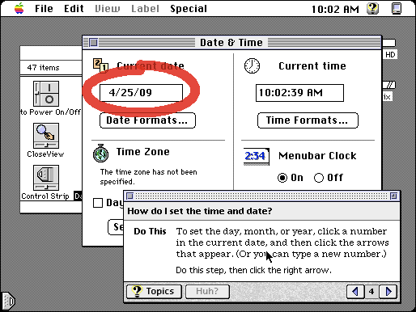
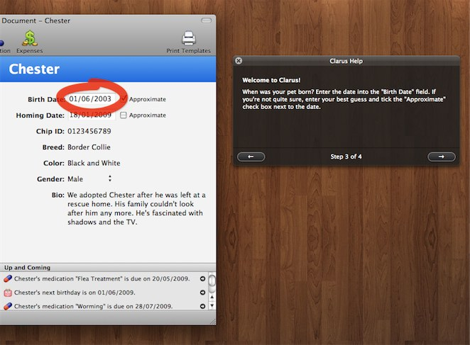

KNAppGuide
==========
by Daniel Kennett

# What is KNAppGuide?

KNAppGuide is a Cocoa framework for adding interactive tutorials to your application. It's very much inspired by Apple Guide from the System 7 era:



This framework brings this idea to the modern world of Cocoa:



Features include:
- Beautiful, intuitive tutorials to guide users through your application. A HUD window presents your guide content while a bold, clean highlight highlight the area in your application's UI the user should focus their attention on. 
- Intelligent UI handling. The guide will automatically move along as the user performs actions in your app. This makes guides much easier to follow, as your app's user experience isn't fragmented by having to click "Next Step" after every action.
- Easy integration. Using KNAppGuide is easy. Import the framework, build a guide in code or in a file (or a combination of the two). If you have your guide in a file, you can load it and begin its presentation in three lines of code.
- Extensible. If KNAppGuide doesn't do quite what you need, it's fully extensible out of the box - have it interact with your custom controls or present your guide content with your own custom guide UI. The guide loader is smart enough to instantiate any custom classes and set custom values without any modification to it at all.

Planned features include:
- A program to author help content so you don't have to manually make plists.
- ... that's it, so far. Submit feature requests please!

# Using KNAppGuide

Adding KNAppGuide to your application is simple: 

1.	Add the KNAppGuide framework into your application.
2.	Set up a "Copy Files" build step to your app's build that copies files to the Frameworks folder, and add KNAppGuide to it.
3.	#import <KNAppGuide/KNAppGuide.h> in the class you'd like to use KNAppGuide in.

To load a guide from file and present it takes an almost negligible amount of code:

	id <KNAppGuide> guide = [KNAppGuide guideWithName:@"Sample Guide" 
											 resolver:[KNAppGuideBasicKVCResolver basicResolverWithBaseObject:self]];
	
	KNAppGuideHUDPresenter *presenter = [[[KNAppGuideHUDPresenter alloc] initWithGuide:guide] autorelease];
	[presenter beginPresentation];

## Highlighting toolbar items

If you want to highlight toolbar items, please be aware that if you want to highlight a "built-in" item such as the Customize, Print, etc items in a toolbar created in Interface Builder, you'll need to be a bit clever due to the way these items are added to the toolbar - you can't just use the toolbar item linked to an IBOutlet, since the built in items are copied into the toolbar, leaving the -toolbar property of your linked item as nil. When this is the case, the framework can't find the toolbar the item is in, and thus can't figure out its location to draw the highlight. 

Included in the framework is KNToolbarExtensions, an NSToolbar extension that provides the -itemWithIdentifier: method. If you'd like to highlight a built-in toolbar item, you'd need to update your step's highlighted view when the step is about to be displayed. This might be achieved like this:

	#import "KNToolBarExtensions.h"
	
	-(void)presenter:(id <KNAppGuidePresenter>)aPresenter willMoveToStep:(id <KNAppGuideStep>)aStep inGuide:(id <KNAppGuide>)aGuide {
		
		if ([[aStep highlightedItem] isKindOfClass:[NSToolbarItem class]]) {
			[aStep setHighlightedItem:[[[self window] toolbar] itemWithIdentifier:[(NSToolbarItem *)[aStep highlightedItem] itemIdentifier]]]; 
		}
	}

## Further details

Take a look at the sample application for an example of how to create and present a simple guide. The headers for each class contain further documentation on how to use the framework.

If you've any questions, please contact me using the details below:

Twitter: iKenndac

AIM: kenndac

Thanks,

-- Daniel
